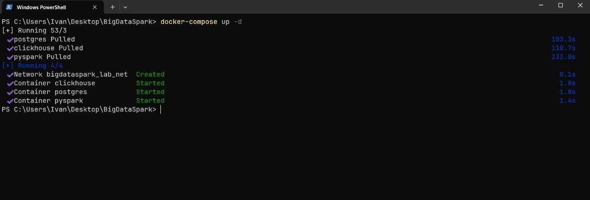
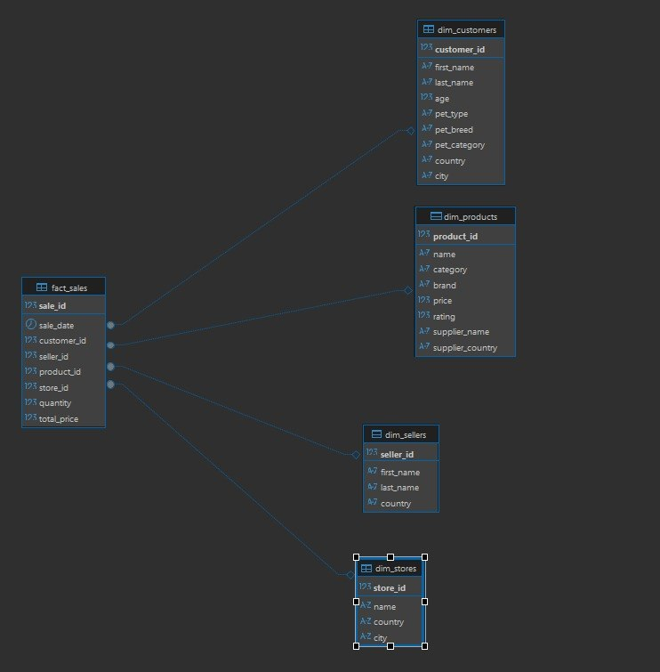
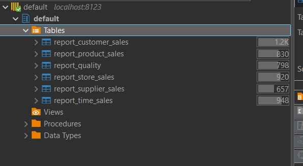
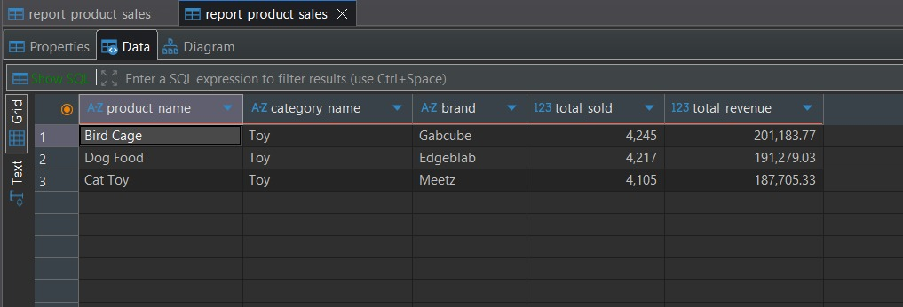
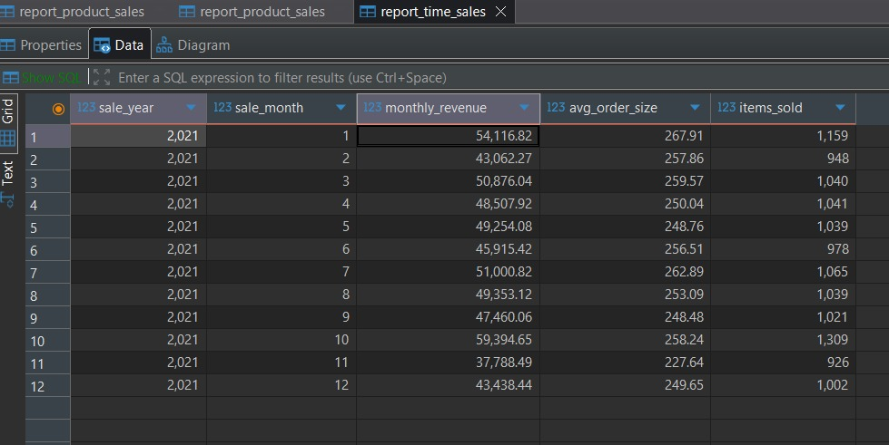
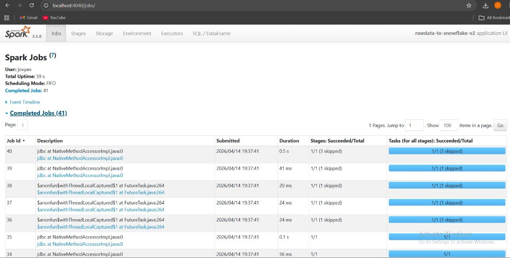

# Отчет по лабораторной работе №2: Реализация ETL-пайплайна в Apache Spark и построение витрин в ClickHouse

## Введение
Данная работа посвящена построению распределенного ETL-пайплайна. Основная задача — перенос логики обработки данных из реляционной СУБД во внешний движок вычислений **Apache Spark**, нормализация данных в модель «Снежинка» и экспорт аналитических отчетов в NoSQL СУБД **ClickHouse**.

---

## Архитектура решения
В данной реализации используется разделение ответственности (Separation of Concerns):
1.  **PostgreSQL (Storage):** Хранилище сырых данных и нормализованной модели.
2.  **Apache Spark (Compute):** «Мозг» системы. Выполняет все преобразования, джоины и агрегации.
3.  **ClickHouse (OLAP):** Аналитическое хранилище, оптимизированное для быстрой выборки из итоговых витрин.

---

## Ход работы

### 1. Подготовка базы данных (SQL)
Первичная настройка БД автоматизирована через скрипты в папке `sql/init`. 
*   `01_raw_data.sql`: Создание таблицы и автоматический импорт 10 CSV-файлов через команду `COPY`.
*   `02_star.sql`: Создание пустой структуры «Снежинка» (таблицы измерений и фактов) с соблюдением ссылочной целостности (Foreign Keys).

---

### 2. ETL-процесс №1: Нормализация в PostgreSQL

В процессе нормализации исходной таблицы `raw_data` была выполнена декомпозиция данных с приведением структуры к модели «звезда» (Star Schema). Основной задачей являлось устранение дублирования, упрощение структуры и оптимизация схемы под аналитические запросы.

В отличие от модели «снежинка», в данной реализации сознательно использовалась **частичная денормализация измерений**, что позволяет сократить количество JOIN-операций и повысить производительность OLAP-запросов.

---

#### 1. Обработка данных о поставщиках
Поля:
- `supplier_name`
- `supplier_country`

**Решение:**
Поля сохранены в таблице `dim_products` и не вынесены в отдельное измерение.

**Обоснование:**
- В модели «звезда» допускается хранение зависимых атрибутов внутри измерения.
- Поставщик функционально зависит от продукта в рамках набора данных.
- Исключено усложнение схемы и дополнительные JOIN-операции.
- Упрощается построение витрин (например, анализ по товарам и поставщикам без дополнительных соединений).

---

#### 2. Обработка данных о питомцах клиентов
Поля:
- `pet_type`
- `pet_breed`
- `pet_category`

**Решение:**
Поля оставлены в таблице `dim_customers` без выделения в отдельную таблицу.

**Обоснование:**
- Являются атрибутами клиента, а не самостоятельной сущностью.
- В модели «звезда» подобные зависимости не выносятся в отдельные таблицы.
- Уменьшается количество JOIN-ов при сегментации клиентов.

---

#### 3. Устранение дублирования данных
В исходной таблице `raw_data` наблюдалось дублирование информации о:
- клиентах
- товарах
- продавцах
- магазинах

**Решение:**
Данные выделены в отдельные таблицы измерений:
- `dim_customers`
- `dim_products`
- `dim_sellers`
- `dim_stores`

Центральной таблицей стала:
- `fact_sales`

**Обоснование:**
- Соответствие архитектуре «звезда» (одна таблица фактов + набор измерений)
- Снижение избыточности хранения
- Упрощение аналитических запросов (простые JOIN по ключам)

---

#### 4. Работа с производными полями
Поле:
- `total_price`

**Решение:**
Сохранено в таблице фактов `fact_sales`, несмотря на вычисляемость (`quantity * price`).

**Обоснование:**
- Типичная практика для OLAP-систем (денормализация ради скорости)
- Снижение вычислительной нагрузки при агрегациях
- Ускорение построения витрин

---
В результате преобразований:
- схема приведена к модели «звезда»
- минимизировано количество JOIN-операций
- устранено дублирование данных
- сохранена необходимая денормализация для ускорения аналитики

Полученная структура обеспечивает эффективную работу аналитических запросов и соответствует практикам построения DWH-систем.

---

### 3. ETL-процесс №2: Аналитические витрины в ClickHouse
С помощью ноутбука `clickhouse.ipynb` данные из PostgreSQL агрегируются и переносятся в ClickHouse. Было реализовано 6 обязательных витрин:

1.  **Витрина продуктов:** Анализ выручки и популярности товаров (Топ-10).
2.  **Витрина клиентов:** Сегментация по странам и расчет среднего чека.
3.  **Витрина времени:** Динамика продаж по месяцам и годам.
4.  **Витрина магазинов:** Топ-5 самых прибыльных точек и распределение по городам.
5.  **Витрина поставщиков:** Выручка и средняя стоимость товаров от каждого партнера.
6.  **Витрина качества:** Анализ связи между рейтингом товара и объемом его продаж.

---

## Технический аудит (Spark UI)
Использование Apache Spark подтверждается наличием выполненных задач в Spark Web UI.

---

## Результаты и выводы
В ходе выполнения лабораторной работы была успешно реализована архитектура современного аналитического хранилища данных. 

**Основные выводы:**
*   **Масштабируемость:** Вынос вычислений в Spark позволяет обрабатывать объемы данных, значительно превышающие лимиты одной реляционной БД.
*   **Эффективность аналитики:** Перенос итоговых отчетов в ClickHouse позволил сократить время выполнения аналитических запросов за счет колоночного хранения данных.
*   **Автоматизация:** Весь процесс — от очистки данных до построения витрин — теперь описывается кодом (Pipeline as Code), что минимизирует человеческий фактор.

---

## Инструкция по запуску
1.  Склонировать репозиторий.
2.  Запустить инфраструктуру: `docker-compose up -d`.
3.  Дождаться автоматической инициализации PostgreSQL (импорт CSV произойдет автоматически при старте).
4.  Открыть Jupyter Lab по ссылке из логов: `docker logs pyspark`.
5.  Последовательно запустить:
    1.  `star.ipynb`
    2.  `clickhouse.ipynb`
6.  Проверить отчеты в ClickHouse через DBeaver (порт **8123**).